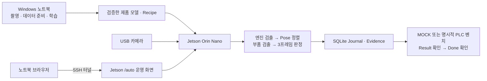

# On-Device AI 엔진 조립 검사

**Jetson Orin Nano가 USB 카메라 영상에서 엔진의 조립 상태를 검사하고, 노트북은 촬영·개발·운영 화면 접속을 맡는 프로젝트입니다.** 검사 결과는 `PASS / FAIL / REVIEW / ERROR`로 저장하며, 제품 추적과 PLC 요청을 연결합니다.

**현재 사용하는 AI 모델 두 개와 Pose 기준 자산을 이 저장소에 포함합니다.** `git clone`과 GitHub의 **Code → Download ZIP** 모두 실제 모델 파일을 받습니다. Git LFS나 별도 모델 다운로드가 필요하지 않습니다.

## 다운로드와 시작

```bash
git clone https://github.com/tmdgns104/Engine_Assembly_Defect_Inspector.git
cd Engine_Assembly_Defect_Inspector
```

ZIP을 사용하면 먼저 전체 압축을 풉니다. 두 장비에 같은 저장소를 받아도 됩니다. 아래 설치 작업은 각 장비에서 수행합니다.

| 장비 | 들어 있는 파일 | 처음 할 일 |
|---|---|---|
| Windows 10/11 x64 노트북 | [`notebook/`](notebook/README.md): 촬영 앱, 데이터 준비·학습 도구, SSH 화면 연결, 패키징·시험 | Python 3.13 x64 설치 → `notebook/setup_capture.cmd` → `notebook/start_misassembly.cmd` |
| Jetson **Orin Nano** | [`jetson/`](jetson/INSTALL.md): 실행 코드, 웹 HMI, 모델·Recipe·Pose, 최초 설치 도구 | 지원 JetPack 준비 → 카메라 by-id 확인 → `bash jetson/setup.sh /dev/v4l/by-id/실제카메라-video-index0` |

Jetson 설치는 `~/oned_device_bench/current`에 실행 코드를, `assets`에 모델을 배치합니다. 장치별 설정과 데이터는 별도 폴더에 보존합니다. 설치 후 안내되는 명령으로 서버를 시작하고 Jetson 브라우저에서 `http://127.0.0.1:18771/auto`를 엽니다. 노트북에서는 [SSH 접속 안내](notebook/README.md#jetson-운영-화면-접속)를 따릅니다.

지원 기준은 **Orin Nano / Linux aarch64 / Python 3.10 / TensorRT 10.3 / CUDA 12.6**입니다. 기존 Jetson Nano(Orin이 아닌 구형 모델)는 이 TensorRT 모델의 실행 대상이 아닙니다. [NVIDIA는 직렬화된 TensorRT 엔진의 플랫폼·GPU·버전 호환에 제약이 있음을 명시합니다.](https://docs.nvidia.com/deeplearning/tensorrt/latest/inference-library/engine-compatibility.html) 모델은 포함되어 있지만 OS·드라이버·Python과 연결한 카메라의 설정은 장치에서 준비해야 합니다.

## 시스템 구성



검사 카메라·AI·Journal은 Jetson에서 실행됩니다. 노트북이 꺼져도 Jetson에서 이미 시작한 서버는 독립적으로 실행됩니다. 노트북의 촬영 앱은 학습 자료를 수집하는 별도 프로그램입니다.

## 포함 모델

| 모델 | 역할 | 파일 크기 | SHA-256 앞 12자리 |
|---|---|---:|---|
| [`dynamic_parts_005/model.plan`](jetson/products/ENGINE_Z3005_5/dynamic_parts_005/model.plan) | 부품 검출과 조립 판정 입력 | 10,092,164 bytes | `743ce54b4d5c` |
| [`envelope_v007_fp16/model.plan`](jetson/products/ENGINE_Z3005_5/envelope_v007_fp16/model.plan) | 엔진 전체 위치 검출 | 13,556,092 bytes | `c82f2658ac20` |

두 모델의 manifest·Recipe·전처리·기동 점검 이미지, D001 Pose 기준 이미지와 Pose bank도 함께 있습니다. 기존 운영 자산의 바이트/해시를 유지했습니다. 설치 전 아래 명령은 GPU·카메라·PLC 없이 파일과 해시를 검사합니다.

```bash
python jetson/install.py --check-only
```

학습 원본 전체, 운영 DB, 개인 SSH 설정, 보호된 E04 자료는 배포하지 않습니다. 모델 및 외부 의존성의 출처·사용 범위는 [모델 안내](jetson/products/README.md)를 확인하세요.

## 현재 진척 — 2026-09-30

| 항목 | 확인된 결과 | 남은 검증 / 제한 |
|---|---|---|
| Jetson 검사·웹 HMI | TensorRT 검사, 단일 카메라 Worker, SQLite/Evidence, 제품별 Track, `/auto` 구현 | 새 장치에서 카메라·GPU·작업면 확인 필요 |
| 정지 제품 PLC 벤치 | 9월 28일 PASS → FAIL → PASS 세 제품을 별도 요청·저장·종료 | 생산 정확도와 실제 배출 동작을 의미하지 않음 |
| 이동 검사 | MOCK에서 고유 3프레임 검사·ACK·제품 이탈 후 다음 제품 대기 확인 | 실제 컨베이어 속도·연속 제품 미검증 |
| 실제 PLC 이동 벤치 | 9월 29일 REVIEW 저장 후 Result=1 / Done=1·요청 해제 확인 | 빈 작업면 오점유로 자동 종료가 막힌 사례, Sysmac 표시와 CIP 읽기 불일치 미해결 |
| Windows 촬영 | 기존 Wizard와 간편 촬영 소스 포함. 10° 간격 총 654장 계획. 최종 EXE GUI 7항목·HCAM 40프레임 미리보기 확인 | 실물 엔진 원본 저장·타 PC 조작·후속 학습은 미검증 |
| GitHub 배포 | 모델 포함, 장비별 설치·파일 점검 도구, 공개 스냅샷 검증 절차 | 모든 PC/Jetson에서 실물 실행을 완료했다는 의미는 아님 |

기존 Jetson의 마지막 기록된 실행 릴리스는 `engine-dev-745e95e832c6b402`입니다. 이 저장소의 설치용 패키지 ID는 포함된 파일 해시로 새로 계산되며 기존 장치에 자동 적용되지 않습니다. 새 설치는 **MOCK**, 물리 출력 비활성입니다. PASS의 PLC Result는 0, FAIL·REVIEW·ERROR는 1이며 저장 완료 전에 결과를 보내지 않습니다.

세부 근거: [이동 검사 Task](tasks/ENGINE-CONVEYOR-MOTION-001.md), [촬영 Task](tasks/ENGINE-MISASSEMBLY-CAPTURE-001.md), [GitHub 배포 Task](tasks/GITHUB-DEPLOYMENT-001.md), [누적 STATUS](docs/STATUS.md). 과거 완료 기록과 미해결 한계를 구분합니다.

## 개발·발표 자료

- [Jetson 코드 읽는 순서](jetson/README.md) · [새 Jetson 설치](jetson/INSTALL.md) · [Windows 사용법](notebook/README.md)
- [노트북에서 패키징 및 기존 장치 업데이트](notebook/deployment/README.md)
- [프로젝트 범위](docs/PROJECT.md) · [아키텍처](docs/ARCHITECTURE.md) · [결정 기록](docs/DECISIONS.md)
- `hardware/`는 설치물 설계, `docs/`·`tasks/`는 계약과 검증 기록입니다. 이전 경로를 적은 과거 문서는 당시 증거로 보존합니다.

소스 수정은 `jetson/`와 `notebook/`에서 시작합니다. `runs/`, `archives/`, `dist/`와 옛 루트 소스 사본은 개발·복구용 로컬 자료이며 새 실행 원본이 아닙니다.
