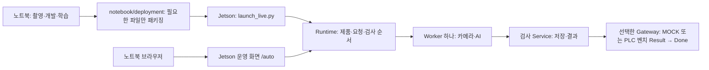

# 엔진 조립 검사 프로젝트

**코드를 수정할 때는 `jetson/` 또는 `notebook/`에서 시작하세요.** 날짜나 `candidate` 이름으로 최신 버전을 고르지 않습니다.

VS Code에서는 [`Engine_Assembly.code-workspace`](Engine_Assembly.code-workspace)를 열면 Jetson·Notebook·문서·기구 설계가 각각 표시됩니다. 대용량 자료와 과거 후보를 소스 탐색창에 섞지 않습니다.

| 폴더 | 실행 장치 / 역할 | 처음 읽을 파일 |
|---|---|---|
| [`jetson/`](jetson/README.md) | Jetson Orin Nano: 카메라, AI 검사, 제품 추적, 결과 저장, 운영 화면, MOCK/PLC 벤치 요청 처리 | [`launch_live.py`](jetson/launch_live.py) → [`bootstrap.py`](jetson/src/runtime/bootstrap.py) |
| [`notebook/`](notebook/README.md) | Windows 노트북: 개발, 학습용 촬영·데이터 준비·학습, Jetson 배포 묶음 제작 | [`start_capture.cmd`](notebook/start_capture.cmd), [`deployment/`](notebook/deployment/README.md) |
| `hardware/` | 카메라 설치물·치수·기구 설계 | 해당 설치물 안내 |
| `docs/`, `tasks/` | 계약·과거 결정·작업 기록. 예전 문서의 경로는 당시 기준 | 현재 소스 설명은 위 두 README 우선 |
| `runs/`, `archives/`, `data/`, `dist/` | 노트북에만 보관하는 실험, 백업, 원본, 배포 산출물 | 실행 소스 선택에 사용하지 않음; Git 제외 |

노트북 브라우저는 Jetson의 화면을 보여 줍니다. 실제 검사 카메라·모델·Journal은 Jetson이 소유하며, 정상 검사에 노트북 파일 공유가 필요하지 않습니다. Windows 촬영 프로그램은 노트북에 연결한 카메라로 학습 자료를 수집하는 별도 도구입니다.

## 현재 버전과 검증 상태

2026-09-28 실제 PLC 벤치 3제품 시험 기준입니다. 이전 v004 복사본은 이력이고, 실제 실행본은 아래 release입니다. 과거 출처는 [`source_baseline.json`](notebook/deployment/source_baseline.json), 현재 배포 포함 목록은 [`runtime_allowlist.json`](notebook/deployment/runtime_allowlist.json)에 있습니다.

- **개발 소스:** `jetson/`, `notebook/`. 앞으로 이 위치를 수정합니다.
- **현재 Jetson 실행 경로:** `/home/jetson/oned_device_bench/current`. 2026-09-28 실제 기동과 단독 카메라 Worker를 확인했습니다. 자산은 `assets`, 장치 설정은 `config`, 현재 검사 이력은 `data/engine_dynamic_pose_002`입니다.
- **현재 실행 릴리스:** `engine-dev-1203e23f30adda37`. 점유 설정 `088a68566bbb4e3f6de63ec547c117b0077a38a1af0773a32459b70d20f2a5f1`은 검정 작업면을 매 프레임 관측하며 고정 빈 기준 이미지를 사용하지 않습니다. 모델 package manifest는 `03bb926b2e54bd17b1a1033200218bc33e8595e15916e2885aae05d802cc6675`입니다.
- **실물 검증:** 같은 AUTO 세션에서 Track 1 PASS→Track 2 FAIL→Track 3 PASS를 별도 검사·PLC 요청으로 처리하고, 각각 완전 제거 후 자동 종료했습니다. 세 번째의 짧은 모호성 복귀도 실제 Journal에 기록됐습니다. 세부 근거는 노트북 로컬 `runs/engine_dynamic_pose_002/fixes/ENGINE-PRODUCT-TRACK-ROBUSTNESS-002/RESULT_KO.md`에만 보관합니다.
- **출력:** 현재 장치는 `OMRON_CIP_BENCH`로 실제 PLC의 세 BOOL 태그만 시험하며 `physical_output_enabled=false`입니다. PASS는 Result=0, FAIL·REVIEW·ERROR는 Result=1입니다. 실제 컨베이어·포토센서·물리 출력·생산 정확도는 미검증입니다. AUTO는 시험 후 정지했습니다.

소스 정리·패키징 통과와 검사 기능의 실물 수용은 별개입니다. Pose REVIEW, 대용량 진단 기록 중 관측 지연의 기존 한계도 해결된 것으로 표시하지 않습니다.

Jetson의 옛 코드·개발 자료는 노트북 백업을 확인한 뒤 승인된 34,141개 항목만 삭제했습니다(약 21.47GB 확보). 관리 영역에서 실행환경을 제외한 코드 파일은 `current`에만 있습니다. 옛 `candidates`에 남은 것은 보호된 검사 DB·Evidence 등 데이터이며 실행 후보가 아닙니다. 백업 대응표는 로컬 `archives/jetson/runtime_only_inventory.json`에 있습니다.

## 실행과 다른 장치 배포

- Windows 촬영: [`notebook/README.md`](notebook/README.md).
- Jetson 모듈을 위에서 아래로 읽기: [`jetson/README.md`](jetson/README.md).
- 파일 묶음 제작·장치별 설정·기동·복귀: [`notebook/deployment/README.md`](notebook/deployment/README.md).
- 기존 테스트 화면: SSH 터널을 연결한 노트북에서 `http://127.0.0.1:18771/auto`.
- 노트북 바로가기: [`notebook/OPEN_ENGINE_HCAM.cmd`](notebook/OPEN_ENGINE_HCAM.cmd). 장치 접속 설정은 Git 밖 `notebook/deployment/targets/current.json`에서 읽습니다.

Git에는 소스·설정 형식·배포 목록을 보관합니다. TensorRT 모델, Pose bank, 승인 기준 이미지, 촬영 원본, 운영 DB는 별도 파일입니다. **Git clone만으로 모델·승인·장치 환경이 준비되지는 않습니다.** 필요한 운영 자산은 해시가 확인된 로컬 배포 묶음으로 전달하며, 장치마다 카메라와 실행환경을 확인합니다.

기존 루트 `apps/`, `src/`, `training/`, `scripts/`와 `docs/code_reading/`은 이전 경로/설명용 사본입니다. 로컬 원본은 보존하며 새 개발 시작점으로 사용하지 않습니다. 과거 검증 기록의 경로와 해시는 당시 그대로 유지합니다.
